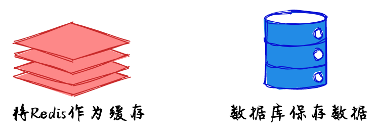

<div align="center" style="display:flex;flex-direction:column;">
  <a href="https://excalidraw.com">
    
  </a>
  <h3>虚拟白板，用于素描手绘画<br>支持协作和端到端加密.</h3>
  <p>
    <a href="https://twitter.com/Excalidraw">
      
    </a>
    <a target="_blank" href="https://crowdin.com/project/excalidraw">
      
    </a>
  </p>
  <p>Ask questions or hang out on our <a target="_blank" href="https://discord.gg/UexuTaE">discord.gg/UexuTaE</a>.</p>
</div>
在原基础上增加了对中文的支持， ** 中文字体仅用于个人用途，请勿商用 **

示例： <a href="https://draw.smart-lifestyle.cn">  </a>

### 声明

使用的<a target="_blank" href="http://www.foundertype.com/index.php/FontInfo/index/id/618.html">字体</a> 仅用于个人研究，不用于任何商业用途

### 修改

#### 获取源码

```bash
git clone https://github.com/excalidraw/excalidraw.git
```

#### 增加中文支持

1. 修改 fonts.css，增加中文字体

```css
@font-face {
  font-family: "FZXUJLXSJW";
  src: url("FZXUJLXSJW.woff");
  font-display: swap;
}
```

2. 修改 index.html，引用字体

```html
<link
  rel="preload"
  href="FZXUJLXSJW.woff"
  as="font"
  type="font/woff"
  crossorigin="anonymous"
/>
```

3. 修改 actionProperties.tsx

```tsx
import FontFamilyHandDrawnChineseIcon
...
...
PanelComponent: ({ elements, appState, updateData }) => {
    const options: {
      value: FontFamilyValues;
      text: string;
      icon: JSX.Element;
    }[] = [
      {
        value: FONT_FAMILY.Virgil,
        text: t("labels.handDrawn"),
        icon: <FontFamilyHandDrawnIcon theme={appState.theme} />,
      },
      {
        value: FONT_FAMILY.Helvetica,
        text: t("labels.normal"),
        icon: <FontFamilyNormalIcon theme={appState.theme} />,
      },
      {
        value: FONT_FAMILY.Cascadia,
        text: t("labels.code"),
        icon: <FontFamilyCodeIcon theme={appState.theme} />,
      },
      {
        value: FONT_FAMILY.FZXUJLXSJW,
        text: t("labels.handChinese"),
        icon: <FontFamilyHandDrawnChineseIcon theme={appState.theme} />,
      },
    ];
...
...
...
```

4. 增加中文手写板图标

```tsx
export const FontFamilyHandDrawnChineseIcon = React.memo(
  ({ theme }: { theme: "light" | "dark" }) =>
    createIcon(
      <>
        <path
          fill={iconFillColor(theme)}
          d="M 290.74 93.24 l 128.02 128.02 l -277.99 277.99 l -114.14 12.6 C 11.35 513.54 -1.56 500.62 0.14 485.34 l 12.7 -114.22 l 277.9 -277.88 z m 207.2 -19.06 l -60.11 -60.11 c -18.75 -18.75 -49.16 -18.75 -67.91 0 l -56.55 56.55 l 128.02 128.02 l 56.55 -56.55 c 18.75 -18.76 18.75 -49.16 0 -67.91 z A 1 1 0 0 0 438 13 M -67 451 A 1 1 0 0 0 91 573"
        />
        ,
      </>,
      { width: 640, height: 640 },
    ),
);
```

5. 修改 constants.ts

```ts
// 1-based in case we ever do `if(element.fontFamily)`
export const FONT_FAMILY = {
  Virgil: 1,
  Helvetica: 2,
  Cascadia: 3,
  FZXUJLXSJW: 4,
};
```

6. 修改 zh-CN.json，增加中文描述

```json
 "handChinese": "中文手写",

```

### 编译

```bash
yarn build
```

### 发布

生成的文件位于 build 文件夹，可以通过 Nginx 代理或者使用云平台提供的对象存储进行托管，比如我将我个人的修改部署在了腾讯的 Serverless 应用上

### 配置域名和证书

证书可以在https://freessl.cn/ 上申请免费证书

### 参考

[1] [方正徐静蕾行书字体包](http://www.foundertype.com/index.php/FontInfo/index/id/618.html)

[2] [分享一个在线做图的开源工具-excalidraw](https://blog.magicdu.cn/744.html)
